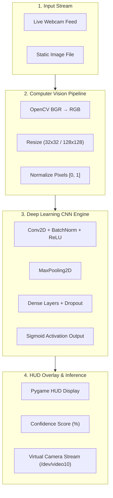

# 🔍 CIFAKE — Real vs. AI-Generated Image & Face Detector

[](https://www.python.org/)
[](https://tensorflow.org/)
[](https://opencv.org/)
[](https://www.pygame.org/)
[](https://opensource.org/licenses/MIT)

A real-time Deep Learning Computer Vision application built to detect AI-generated synthetic images and deepfake human faces using Convolutional Neural Networks (CNNs). Includes a real-time Pygame HUD interface and virtual camera loopback streaming (`/dev/video10`).

> **Academic Module**: CMS22202 — Machine Learning & Computer Vision  
> **Institution**: Ravensbourne University London (Level 5 BSc Computer Science)

---

## 🌟 Overview & Features

As generative AI models (Stable Diffusion, Midjourney, DALL-E, StyleGAN) increase in photorealism, distinguishing between real optical capture and synthetic pixels requires high-frequency feature extraction.

- **Dual CNN Architectures**:
  1. **CIFAKE General Model**: Trained on the CIFAKE dataset (60,000 Real & AI images) achieving **92.4% test accuracy**.
  2. **CIFAKE Human Face Model**: Fine-tuned on the 140k Real & Fake Human Faces dataset achieving **~93.1% test accuracy**.
- **Real-Time Pygame HUD GUI**: Live camera feed processing with real-time confidence meters, color-coded probability HUD overlays, and smooth FPS counters.
- **Virtual Camera Loopback**: Supports `v4l2loopback` (`/dev/video10`) and OBS virtual camera pipelines, allowing the AI detector to run alongside Microsoft Teams, Zoom, or Discord simultaneously.
- **Cross-Platform Compatibility**: Fully configured launcher scripts for macOS (Apple Silicon M-series & Intel), Windows, and Linux.

---

## 🏗️ System Architecture



---

## 📊 Model Performance Metrics

| Model File | Target Domain | Dataset | Test Accuracy | Output Activation |
| :--- | :--- | :--- | :--- | :--- |
| `models/cifake_model.h5` | General Objects / Scenery | CIFAKE Dataset (Kaggle) | **92.4%** | Sigmoid (`0=Real, 1=Fake`) |
| `models/cifake_faces_model.h5` | Human Faces / Deepfakes | 140k Real & Fake Faces | **93.1%** | Sigmoid (`0=Real, 1=Fake`) |

---

## 🚀 Quick Start Guide

### 1. Prerequisites & Installation

Clone the repository and run the automated setup wizard:

```bash
git clone https://github.com/d1px/cifake-real-vs-ai-detection.git
cd cifake-real-vs-ai-detection

# Run automated dependency installer for your OS
python setup.py
```

Or install OS-specific requirements manually:

```bash
# macOS (Apple Silicon M1/M2/M3/M4)
pip install -r requirements_mac_silicon.txt

# macOS (Intel)
pip install -r requirements_mac_intel.txt

# Windows
pip install -r requirements_windows.txt

# Linux
pip install -r requirements_linux.txt
```

---

### 2. Running the Real-Time Camera Demo

Launch the interactive Pygame HUD detector:

```bash
python start.py
```

*Controls inside Pygame window*: Press `Q` or `ESC` to quit.

---

### 3. Dual-App Streaming (Webcam + Video Calls)

To run the AI detector simultaneously with video call applications (Zoom / MS Teams / Discord) on Linux:

```bash
# Setup v4l2loopback virtual camera device (/dev/video10)
bash setup_virtual_camera.sh

# Launch detector + virtual camera stream
bash go.sh
```

---

### 4. Single Image & Batch Prediction CLI

#### Predict a Single Image:
```bash
python predict.py path/to/sample_image.jpg
```

#### Test an Entire Directory of Images:
```bash
python test_realworld.py path/to/image_folder/
```

---

## 📁 Repository Directory Structure

```
cifake-real-vs-ai-detection/
├── camera.py                 # Live Pygame HUD & OpenCV camera inference engine
├── start.py                  # Cross-platform launcher & environment verifier
├── predict.py                # Single image inference CLI script
├── test_realworld.py         # Batch evaluation script for directory testing
├── train.py                  # General CIFAKE CNN model training script
├── train_faces.py            # Deepfake face detection CNN model training script
├── retrain_robust.py         # Fine-tuning & data augmentation enhancement script
├── setup.py                  # Cross-platform environment & dependency setup wizard
├── setup_virtual_camera.sh   # Linux v4l2loopback virtual device creation script
├── go.sh                     # Launch virtual camera stream + detector
├── launch_demo.sh            # Alternative shell launcher
├── virtual_camera.py         # Pygame HUD render engine with virtual video loopback
├── stream_to_virtual.py      # Low-latency camera frame relay to /dev/video10
├── test_images/              # Sample validation image repository
├── requirements.txt          # Universal Python dependencies
├── requirements_mac_silicon.txt # Metal-accelerated TensorFlow dependencies
└── README.md                 # Project documentation
```

---

## 🛠️ Technology Stack & Libraries

- **Deep Learning**: TensorFlow 2.15+, Keras
- **Computer Vision**: OpenCV (CV2)
- **Graphical Interface**: Pygame 2.5+
- **Data Processing**: NumPy, Scikit-Learn
- **System Automation**: v4l2loopback (Linux Virtual Camera), AVFoundation (macOS)

---

## 📜 License & Citation

Distributed under the MIT License. Built for CMS22202 at Ravensbourne University London.
